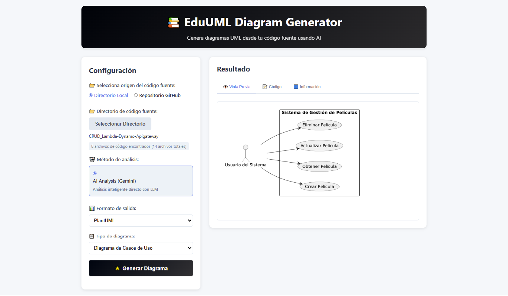
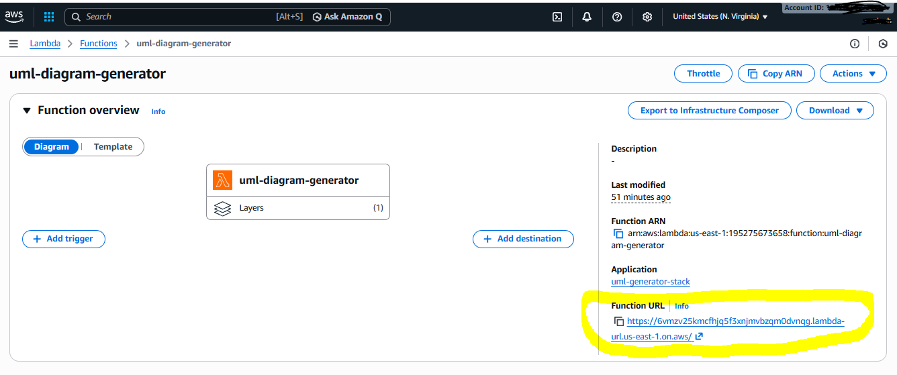
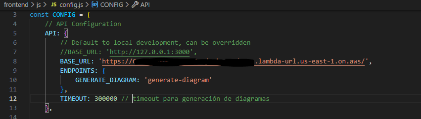

# EduUML Diagram Generator

Aplicación web para generar diagramas UML automáticamente desde repositorios locales o tomando una url de GitHub.
La idea  es jugar con los prompts y testear con diferentes Apis de LLM como Gemini o Claude.
El backend donde se modifica la logica de la generación es una aws lambda y se utiliza el framework SAM de AWS.

⭐Si queres aprender a desplegar aws lambda y sus dependencias este proyecto te puede ser de utilidad.

⭐Una vez generador la codificacion de UML se puede modificar el diagrama en su herramienta correspondiente.




## 🏗️ Arquitectura

```
Frontend (HTML/JS) → AWS Lambda → Análisis de Código con LLM via API → Diagrama UML
```

## 📁 Estructura del Proyecto

```
GenAI-Diagrams/
├── backend/                    # Backend Python
│   ├── src/
│   │   ├── llm/              # Integración con LLMs
│   │   ├── services/         # Servicios de negocio
│   │   ├── handlers/         # Lambda handlers
│   └── tests/                # Pruebas unitarias
├── frontend/                  # Frontend web (próximo)
├── layers/                   # Lambda layers
│   └── dependencies/         # Dependencias Python
├── scripts/                  # Scripts de deployment
├── samconfig.toml           # Necesario para despligue de template-prod.yaml
├── template.yaml            # SAM template para test en local (no en aws)
├── template-prod.yaml       # SAM template para despliegue en aws
└── README.md
```

## 🚀 Desarrollo Local

### Prerrequisitos

- Python 3.12+
- AWS CLI configurado
- SAM CLI instalado
- Docker Desktop
- Git

### Setup

1. **Clonar repositorio:**
   

2. **Instalar dependencias del backend:**
   ```bash
   cd backend
   python -m venv backend_env
   backend_env\Scripts\activate  # Windows
   pip install -r requirements.txt
   ```

3. **Iniciar servidor local:**
 Importante! tener dockerDesktop ejecutando. 
 Reemplazar [TuApikey] por tu apikey de Gemini. El modelo que funciona un 80% correcto es gemini-2.5-flash.
 Notar que template.yaml de SAM es para Desarrollo, pruebas no es para desplegar en AWS.
 En el directorio raiz: 

   ```bash
   sam build --template template.yaml
   sam local start-api --template template.yaml --port 3000 --parameter-overrides GoogleApiKey=[TuApikey] GeminiModelName=gemini-2.5-flash

   ```

4. **Ejecutar tests:**
 Hay un test manual: pruebaGemini.py para probar gemini con tus apikey que no está incluida aqui. Se debe ejectar manual.

   ```bash
   cd backend
   python -m pytest tests/test_github_service.py tests/test_main_handler.py -v
   ```


# Terminal 2: Frontend  

   ```bash
cd frontend && python -m http.server 8080
   ```

🤓 Listo para probar todo local desde la appweb!!

## 🌐 API Endpoints

### POST /
Genera diagrama UML desde repositorio GitHub.

**Request:**
```json
{
  "repo_url": "https://github.com/user/repo",
  "diagram_type": "class",
  "output_format": "plantuml",
  "filters": {
    "max_files": 50
  }
}
```

**Response:**
```json
{
  "diagram_code": "@startuml\nclass User {\n}\n@enduml",
  "format": "plantuml",
  "metadata": {
    "files_analyzed": 15,
    "elements_found": 8
  },
  "success": true
}
```

## 📊 Tipos de Diagramas Soportados

- **class** - Diagrama de clases
- **sequence** - Diagrama de secuencia
- **component** - Diagrama de componentes
- **activity** - Diagrama de actividad
- **usecase** - Diagrama de casos de uso
- **deployment** - Diagrama de despliegue
- **state** - Diagrama de estados

## 🎨 Formatos de Salida

- **plantuml** - Código PlantUML
- **mermaid** - Código Mermaid (Con el modelo Gemini 2.5 Flash no los genera correctamente ❗)
- **drawio** - XML de Draw.io

## 🧪 Testing Local

Puedes probar cualquier curl y vas a notar que genera un diagram.json. El texto del diagrama segun formato que le pidas con con escape sequences (\n, &#10;). Necesitas decodificarlo! 
Ejemplo para drawio:

En PowerShell:

$json = Get-Content diagram.json | ConvertFrom-Json
$json.diagram_code | Out-File -Encoding UTF8 diagram.drawio

En Python:

python -c "import json; data=json.load(open('diagram.json')); open('diagram.drawio', 'w', encoding='utf-8').write(data['diagram_code'])"

En Git Bash (si tienes jq):

jq -r '.diagram_code' diagram.json > diagram.drawio


## 🧪 Ejecucion de Test


```bash
cd backend
python -m pytest tests/ -v
```

## 🔑 Variables de Entorno en la Lambda

- `GOOGLE_API_KEY` - API key de Google Gemini
- `GEMINI_MODEL_NAME` - 
- `PYTHONPATH` - /opt/python:/var/runtime:/var/task

## 🔧 Deployment en AWS

- Validar siempre si el template es valido antes de deployar en aws

```bash
sam validate --template template-prod.yaml --lint
```
- Conviene crear un bucket S3 antes de hacer el deploy:
```bash
aws s3api create-bucket --bucket <NOMBRE_DEL_BUCKET> --region <REGION>
```

- Construir el layer y verificar que no supere los 250mb (es el maximo de Lambda). Es importante revisar .samignore para que no agregué archivos imnecesarios al build.
Para esto necesitas tener ejecutando DockerDesktop.

```bash

sam build --use-container
```
tamaño layer? 

```bash
# Tamaño del zip del Layer
ls -lh .aws-sam/build/DependenciesLayer/

# O el tamaño total
du -sh .aws-sam/build/DependenciesLayer/

```

- Deploy propiamente dicho
El parameter overrides es opcional. 

```bash

sam deploy --s3-bucket=[tunombrebucket] --parameter-overrides GoogleApiKey=xxx
```

## Prueba AWS Lambda deplegada

1. Para probar la conexion a la lambda desplegada que hace las veces de Api, debes tomar la url del ouput del despliegue en aws o bien ingresar a la consola de aws y verificar:



2. En la carpeta frontend/js modificar con la url obtenida en config.js en "BASE_URL"



## Deploy sitio web

Puedes utilizar algun hosting gratuito para simular produccion como Netlify --> con solo subir el directorio **frontend** 


## 🧹 LIMPIEZA en AWS

Este delete tal cual toma lo configurado en .toml que es template o stack desplegado en aws.

```bash
sam delete --no-execute-changeset
sam delete
```

Eliminar bucket de S3

```bash

aws s3 rb s3://<nombre-del-bucket> --force
```

Eliminar cloudwatch de las ejecuciones. Es importante saber que los grupos de logs de cloudwatch no se eliminan con sam delete.

```bash
aws logs describe-log-groups --log-group-name-prefix /aws/lambda/uml-diagram-generator
aws logs delete-log-group --log-group-name /aws/lambda/uml-diagram-generator
```

## Formato de respuesta de backend y prompts
Si queremos modificar los prompts en ..backend/src/prompts.py tener en cuenta que se espera que llm devueva un json con estos dos campos. Hay un prompt por cada diagrama.
{
   "metadata": "Explicación detallada en español para estudiantes",
   "codigoUML": "código {format_diagram} aquí"
}

## Documentacion
- [Documentación de AWS SAM](https://docs.aws.amazon.com/serverless-application-model/latest/developerguide/what-is-sam.html)
- [Documentación de Google Gemini](https://developers.generativeai.google/products/gemini/)


## Desarrollos Futuros

- Integración con más LLMs
- Soporte para más lenguajes de programación
- Mejoras en la interfaz frontend
- Seguridad en las apikey y login en la app

## Autores
🤓 Algo de kiroDev, claude y codigo picado por @reinalau


## 📝 Licencia

Este proyecto está bajo la Licencia MIT - ver el archivo [LICENSE](LICENSE) para más detalles.

**⚠️ Nota Importante:** Este es un proyecto educativo. Revisar y ajustar lo necesario si estas pensando en utilizarlo a nivel productivo.